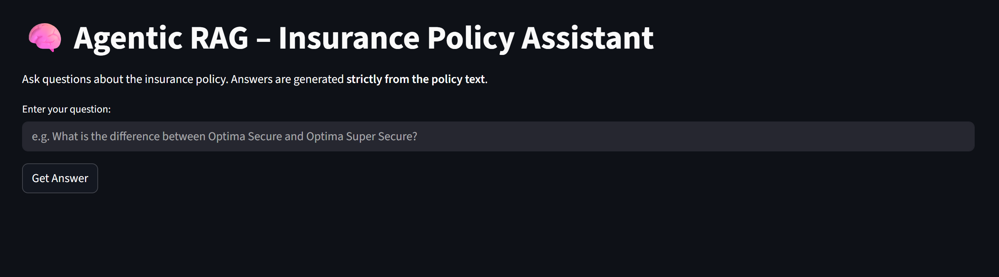

# Agentic RAG System for Insurance Policy Analysis

This repository contains an **agentic Retrieval-Augmented Generation (RAG) system**
designed to answer complex, policy-specific questions from long insurance documents
with **high precision and possiable least hallucination**.

The system is built for **regulated domains** where answers must be grounded
strictly in the source document.

## 🖥️ Interactive Application

Below is the Streamlit-based interactive interface for querying insurance policy documents using the Agentic RAG pipeline:

---

## 🔍 Problem Statement

Insurance policy documents are:
- Long and highly structured
- Difficult to search manually
- Sensitive to incorrect interpretation

Naive RAG systems often:
- Miss section-level context
- Hallucinate policy benefits
- Fail on comparison and procedural questions

This project addresses these challenges using a **precision-first, agentic RAG design**.

---

## 🧠 Solution Overview

The system follows a **multi-stage agentic pipeline**:

1. **Hybrid Chunking**
   - Section-aware segmentation
   - Token-based overlapping subchunks

2. **Dense Retrieval**
   - BGE embeddings
   - FAISS inner-product similarity search

3. **Cross-Encoder Reranking**
   - Improves precision for policy QA

4. **Deterministic Answer Generation**
   - Mistral-7B-Instruct
   - Temperature = 0 (no hallucinations)

5. **Agentic Orchestration**
   - Retrieval → Reranking → Answer
   - Controlled via LangGraph

---

